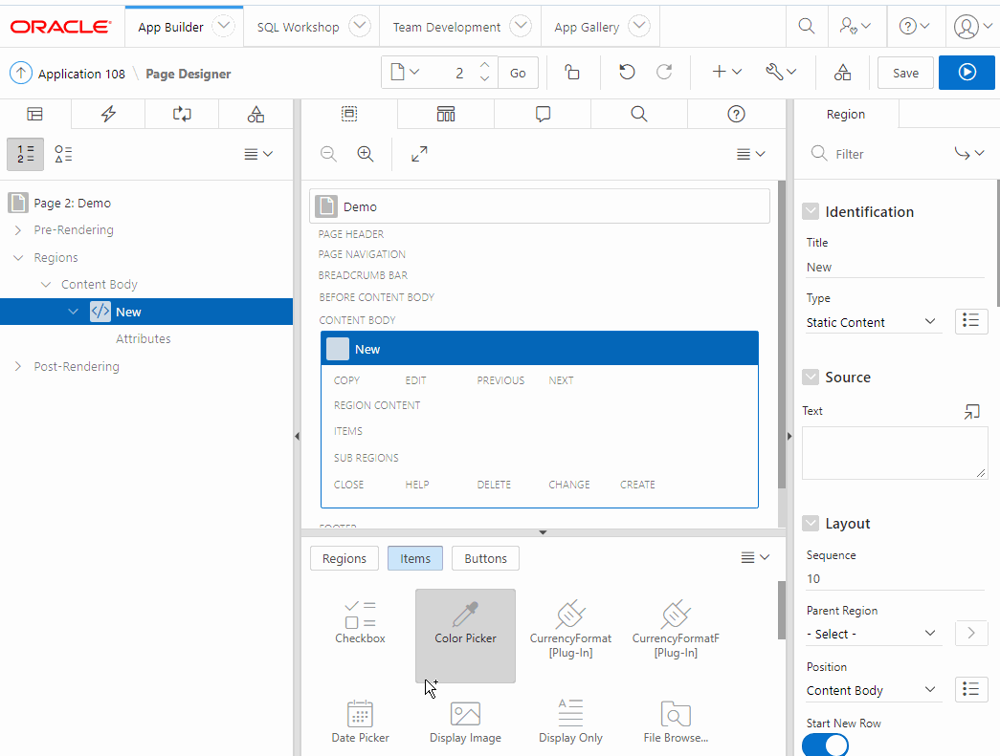

# CurrencyFormat
APEX Plugin providing live, as you type, formatting of currencies.

No longer worry about which grouping and decimal separtors your app will need. This plugin uses the browser language to determine the appropriate symbols and format accordingly.

Currencies codes that are available to be used are listed [here](https://www.currency-iso.org/en/home/tables/table-a1.html)

Javascript is also used to convert to number before submit for easy use when combining with SQL or PL/SQL functions.

## [Demo Application](https://ne4nrdstetiauoz-db201912071546.adb.us-phoenix-1.oraclecloudapps.com/ords/f?p=108)

Demo - English

Demo - German

### Instructions

1.  Download and install plugin
2.  Create new select list or radio button item with currency codes you wish to support
3.  Link the item you created in step 2 to the currencyFormat plugin item 

